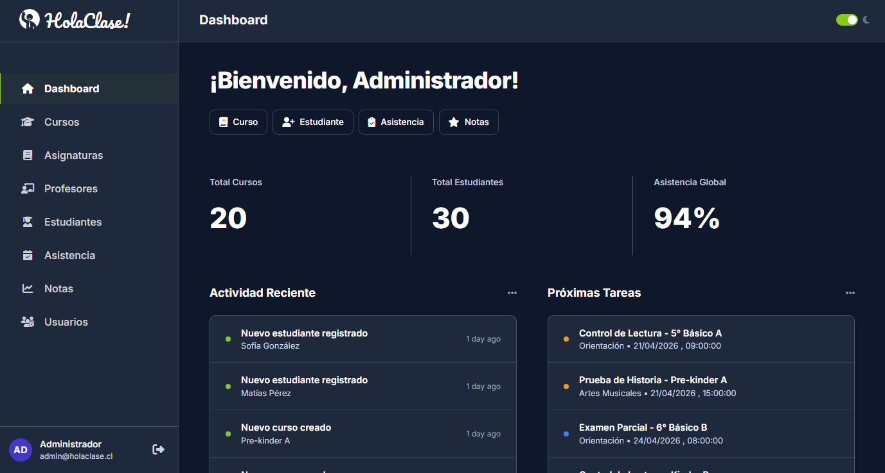

# **🎓 HolaClase**

**Transformando la interacción educativa en un solo clic.**


## **🌟 Sobre el Proyecto**

**HolaClase** es una solución digital diseñada para acortar la brecha entre educadores y estudiantes. En un mundo donde la educación híbrida es la norma, nuestra plataforma ofrece un espacio centralizado, intuitivo y eficiente para gestionar el aprendizaje colaborativo.

Este proyecto nace de la necesidad de simplificar procesos complejos: desde la entrega de tareas hasta la comunicación en tiempo real, todo bajo una interfaz amigable que no requiere curva de aprendizaje.

## **✨ Características Principales**

* **📊 Tablero de Control:** Visualización clara de tareas pendientes y progreso académico.
* **💬 Comunicación Directa:** Sistema de mensajería integrado para resolución de dudas al instante.
* **📂 Gestión de Recursos:** Repositorio centralizado para material de estudio y archivos multimedia.
* **📱 Diseño Responsive:** Accede desde tu computadora, tablet o smartphone sin perder funcionalidad.

## **🛠️ Stack Tecnológico**


## **📸 Vista Previa**

| Vista de Escritorio |
| :---- |
|  |

## **🚀 Instalación y Uso**

Si quieres probar el proyecto localmente, sigue estos pasos:

1. **Clona el repositorio:**
   ```bash
   git clone https://github.com/Edy2020/HolaClase.git
   ```

2. **Navega al directorio:**
   ```bash
   cd HolaClase
   ```

3. **Instala las dependencias:**
   ```bash
   composer install
   npm install
   ```

4. **Configura el entorno:**
   ```bash
   cp .env.example .env
   php artisan key:generate
   ```

5. **Ejecuta las migraciones:**
   ```bash
   php artisan migrate --seed
   ```

6. **Inicia el servidor:**
   ```bash
   php artisan serve
   ```

## **🤝 Contribuciones**

¡Las ideas siempre son bienvenidas!

1. Haz un **Fork** del proyecto.
2. Crea una nueva rama (`git checkout -b feature/NuevaFuncionalidad`).
3. Haz un **Commit** de tus cambios (`git commit -m 'Añade NuevaFuncionalidad'`).
4. Haz un **Push** a la rama (`git push origin feature/NuevaFuncionalidad`).
5. Abre un **Pull Request**.

## **👥 Equipo**

* **Edy2020** - *Desarrollador Principal* - [@Edy2020](https://github.com/Edy2020)
* **Nikitoons** - *Desarrollador Backend* - [@Nikitoons](https://github.com/Nikitoons)

---

Desarrollado con ❤️ para mejorar la educación.